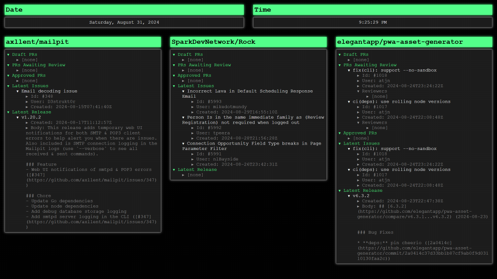

# GitHub Stats Wallpaper

This is a wallpaper built to be used with [Lively](https://github.com/rocksdanister/lively). It shows the current date and time as well as info about any three GitHub repos. This was built pretty quickly for my own use, so it probably has some bugs and it is missing some quality of life features.

## Installing

### Download Lively

1. Download [Lively](https://github.com/rocksdanister/lively) from the Microsoft store or with the installer
2. Wonder why there's a whole section devoted to this when there's only one real step

### Generate a GitHub API Token

1. Go to [GitHub.com](https://github.com) and sign in
2. In the top-right, click your profile image and then select "Settings"
3. At the bottom of the left menu, select "Developer settings"
4. Open the "Personal access tokens" menu and select "Fine-grained tokens"
5. Click the "Generate new token"
6. Give your token a name and expiration date
7. If you are only going to get details about public repos, leave everything else at default and click "Generate token"
8. Otherwise, select either "All repositories" or "Only select repositories"
9. Under the "Repository permissions" section, make sure to give read-only access to "Pull requests", "Issues", and "Contents". No other access is required
10. Click "Generate token"
11. Copy the token and save it for the next section

### Download And Configure The Wallpaper

1. Download the .zip file from the latest release of this repo
2. Drag and drop the .zip file onto the Lively window
3. Click on the three dots on the new "GitHub Stats" wallpaper and click "Customize"
4. Enter your fine-grained personal access token into the "Enter GitHub Token" box
5. Enter the first repo you want stats on into the "First Repo (OWNER/REPO)" box. This should be in the format of OWNER/REPO (e.g. "rocksdanister/lively")
6. Repeat step 6 for the second and third repo
7. Click "OK"
8. Select the wallpaper

*Note: if you select the wallpaper before changing the settings you may either have to wait for the refresh time to elapse or use the "Refresh" button in the customization settings for the wallpaper to re-render.*

## Building From Source

Taking the source code and putting it into a format that Lively can use is as simple as zipping up all of the files into a .zip file. The `README.md`, `cover.png`, and `LICENSE` files can be ignored as they are only used on GitHub and not on the actual wallpaper.

Since this is just HTML, CSS, and JavaScript, it can be run locally like any other static site. I really like using the [Live Server](https://github.com/ritwickdey/vscode-live-server) extension for [VS Code](https://code.visualstudio.com/). For testing the parameters, you can either change the default values in the `scripts.js` file or you can use your developer console to call the `livelyPropertyListener` function.

## Contributing

Contributions are welcome. Just create a Pull Request with the changes and I'll review it. Please make sure to include details on the use case for the change/addition so I have context when deciding whether or not to merge it.

If you have a feature request, feel free to create an issue. Please include the use case for it as well as how you expect it to work so that the person that tackles it has that additional context.

## License

Everything in this repository is licensed under the GNU General Public License v3.0 license with the additional restriction that all covered works must include attribution stating that the original source was written by Jon Corey. This attribution must be publicly visible to the end user without requiring advanced knowledge or actions.

See the LICENSE file for all other terms.
